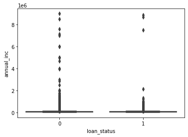
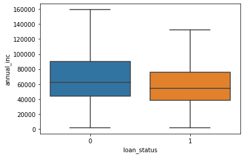
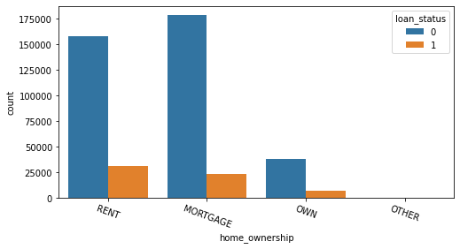
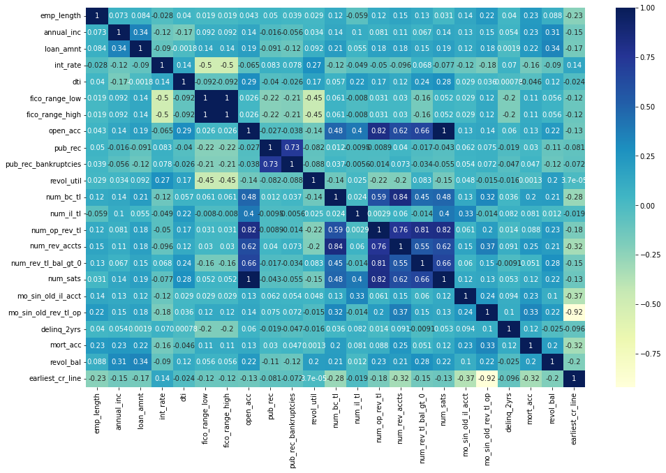
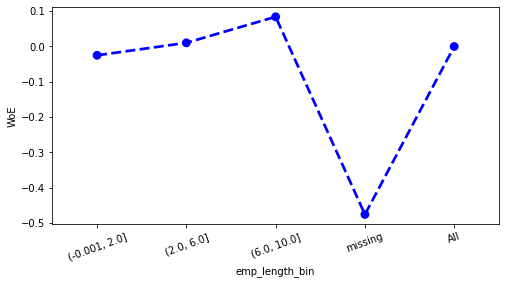
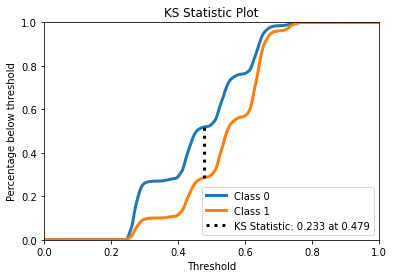
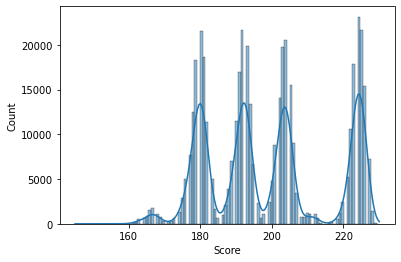
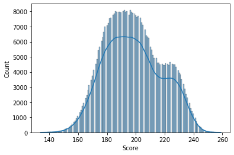

# Scorecard Development on Loan Data

## Table of Contents
1. [Introduction](#introduction)
2. [Dataset Description](#dataset-desc)
3. [Scorecard Development](#scorecard-dev)
4. [Implementation Plan](#implementation)
5. [Conclusions and Recommendations](#conclusion)
6. [References](#references)

## 1. Introduction <a name="introduction"/>

This project is about Scorecard Development using Python. Goal of this project is to create scorecard from loan dataset which later will be used to predict score of new issued loans and determine those loans will be good loans (fully paid) or bad loans (charged off).

---
## 2. Dataset Description <a name="dataset-desc"/>

Dataset that I use is loan data from LendingClub that available in Kaggle. (https://www.kaggle.com/datasets/wordsforthewise/lending-club). LendingClub is a financial service company in peer-to-peer lender that was founded in 2006. The raw dataset has 2,260,701 observations and 151 columns which later we will use sample data of 1,023,206 observations and 31 columns. 

| Personal Information | ‘emp_length’, ‘home_ownership’, ‘annual_inc’, ‘verification_status’, ‘purpose’, ‘addr_state’, ‘application type’ |
| :--- | :--- |
| Loan Information | ‘loan_amnt’, ‘int_rate’, ‘grade’, ‘dti’, ‘fico_range_low’, ‘fico_range_high’ |
| Account Information | ‘open_acc’, ‘pub_rec’, ‘pub_rec_bankruptcies’, ‘revol_util’, ‘num_bc_tl’, ‘num_il_tl’, ‘num_op_rev_tl’, ‘num_rev_accts’, ‘num_rev_tl_bal_gt_0’, ‘num_sats’, ‘mo_sin_old_il_acct’, ‘mo_sin_old_rev_tl_op’, ‘delinq_2yrs’, ‘mort_acc’, ‘revol_bal’, ‘initial_list_status’,  ‘earliest_cr_line’ |
| Response Variable | ‘loan_status’ |

---
## 3. Scorecard Development <a name="scorecard-dev"/>

### i. Data Preparation

In this step, we will eliminate as many irrelevant data for the rest of scorecard development by define the response variable, choose sample window, initial characteristics selection, and split the sample data into train and test dataset.

The data does not provide history of payment of every loan and we only can use loan status which is the current status as response variable. There are several attributes with proportion as follow.

   

We can use ‘fully paid’ status as good loan (value 0), then ‘charged off’ and ‘default’ as bad loan (value 1). Furthermore, there are 2 terms of the loan: ‘36 months’ and ‘60 months’ with proportion 76:24. Since proportion of term ’36 months’ is approximately 3 times of term ’60 months’, we can keep data with term ’36 months’ only.

Next, we can choose sample window by create cohort table of cumulative bad loan by quarter on books as follow.

   

For issue date 2007Q2 until 2015Q4, the time taken for accounts to mature around 12 or 13 quarters. This result is expected since the term of loan is 36 months or 12 quarters. We can choose issued loan on 2007Q-2015Q4 as sample window and this will give us remaining 1,023,206 observations or almost half of the original data. Actually, cohort table is more relevant if we have payment history on the loan data.

For initial characteristics selection, we can drop columns with many null values (more than 50%), columns with only 1 attribute or all unique attributes. Then, we keep columns that related to application of the loan only and the result is total remaining predictor columns is 30 and 1 response columns which is already mentioned in Dataset Description section.

Finally, for train-test-split we use stratify sampling by the response variable. Proportion of good loan and bad loan is 86:14 and the test size is 30%. 14% bad loan is actually high number which can be result of ignore the ‘current’ status.

### ii. Data Exploration

There are 2 types of characteristics: numerical and categorical with slightly different approaches. 

---
For numerical characteristics, the process is:
-	Create descriptive statistics of the characteristic
-	Create distribution plot of the characteristic
-	Create descriptive statistics of the characteristic by response variable
-	Create boxplot of the characteristics

Example: characteristic ‘annual_inc’
-	Boxplot of ‘annual_inc’

   

-	Boxplot of ‘annual_inc’ without outliers

   

-	The annual income of debtors has wide range value and there are many outliers which can be treated by binning.
-	If we exclude the outliers, we can see that median of annual income from bad loan group is lower than from good loan group.

---
For categorical characteristics, the process is:
-	Describe the proportion of the characteristic
-	Create plot count of the characteristic with response variable
-	Create crosstab table and calculate the odds of bad loan.

Example: characteristic: ‘home_ownership’
-	Count plot for ‘home_ownership’

   

-	Crosstab for ‘home_ownership’

| loan_status | 0 | 1 | Odds |
| :---: | :---: | :---: | :---: |
| home_ownership | | | |
| OTHER | 130 | 27 | 0.21 |
| RENT | 157692 | 31022 | 0.20 |
| OWN | 37592 | 6506 | 0.17 |
| MORTGAGE | 178659  | 23062 | 0.13 |
 
-	Status 'RENT' and 'OTHER' has the highest odds of bad loan at 0.20. Status 'OWN' has slightly lower odds at 0.17 and Status 'MORTGAGE' has the lowest odds at 0.13.

---
Next, we can create correlation matrix by Pearson correlation coefficient method on numerical characteristics.

   

From the result, there are 3 pairs with the highest correlation coefficient:
-	‘fico_range_low’ and ‘fico_range_high’ with value 1
-	‘open_acc’ and ‘num_sats’ with value 1
-	‘mo_sin_old_rev_tl_op’ and ‘earliest_cr_line’ with value -0.92

Then, we can drop these characteristics: ‘fico_range_high’, ‘num_sats’, ‘earliest_cr_line’.

### iii. Data Pre-Processing

To create scorecard, usually we do not use the raw input, but using converted value. Those value is called by WoE or Weight of Evidence which measures the strength of each attribute of characteristic. Other value that will be computed is IV or Information Value which measures the total strength of the characteristics.

Since, WoE measures the strength of each attribute, we need binning the numerical characteristics to get attributes or category of those characteristics. The binning process usually by its quartile except some characteristics that need adjustment like in the notebook. Equation to compute WoE is given below.

$$
\begin{align*}
W_i &= \ln ( \\% \text{Good} / \\% \text{Bad} ) \\
W_i &= \ln \left ( \left ( \frac{N_i}{\sum N} \right ) / \left ( \frac{P_i}{\sum P} \right )\right ) 
\end{align*}
$$

Example of WoE plot for ‘emp_length_bin’:

   

- Debtors with longer employment length tend to perform a good loan.
- 'missing' group has tend to perform a bad loan.

For IV, the value is computed using given formula.

$$
\begin{align*}
IV &= \sum_{i=1}^{n} ( \\% \text{Good} - \\% \text{Bad} ) \times W_i \\
IV &= \sum_{i=1}^{n}\left [ \left ( \frac{N_i}{\sum N} - \frac{P_i}{\sum P} \right ) \times W_i \right ] \\
\end{align*}
$$

The results for IV is

| Unpredictive | $IV < 0.02$ | application_type, open_acc_bin, num_rev_accts_bin, delinq_2yrs, num_il_tl_bin, num_bc_tl_bin, initial_list_status, loan_amnt_bin, num_op_rev_tl_bin, pub_rec, pub_rec_bankruptcies, revol_bal_bin, mo_sin_old_il_acct_bin, revol_util_bin, addr_state, emp_length_bin, num_rev_tl_bal_gt_0_bin |
| :--- | :---: | :--- |
| Weak | $0.02 \le IV < 0.1$ | verification_status, purpose, mo_sin_old_rev_tl_op_bin, home_ownership, mort_acc, dti_bin, annual_inc_bin |
| Medium | $0.1 \le IV < 0.3$ |  fico_range_low_bin, int_rate_bin |
| Strong | $IV > 0.3$ | grade |

### iv. Modelling

Since our response variable is a binary variable (good loan or bad loan), we will use Logistic Regression model to get the predicted probability of bad loan. We will use WoE of attribute as input such that make our model simpler, solving problem of differing input units, and ensure the points scaling is logical.

In order to get best model, we will use Forward Selection and Cross-Validation. We will use 10-fold with maximum 15 predictors for forward selection. There are two variations of scoring method will be used: ‘recall’ and ‘roc_auc’.

### v. Model Evaluation

a. Scoring: 'recall'
Best predictors from forward models give 3 predictors only: ‘purpose’, ‘pub_rec’, and ‘pub_rec_bankruptcies’ with recall score 0.75 which mean the model can predict 75% of bad applicants correctly and 25% misclasify bad loan as good loan.  The problem is 3 predictors only is too few and susceptible to minor changes in the applicant profile. 

To solve this problem, we will be doing model adjustment. I choose 12th model from forward model with 12 predictors that give score 0.7. If we add predictors, the score is decreasing quite large. The results on train model are given below.
-	Recall score 0.701
-	AUC score 0.65

   

 
-	KS statistic 0.233

   

If we fit the model on test dataset, we get recall score 0.7 with similar AUC and KS statistic. Value of KS statistic is 0.233 which is a bit low and explain that our model cannot well discriminates between good and bad loan.

---
b. Scoring: 'roc_auc'

Best predictors from forward models give 15 predictors
The results on train model are given below.
-	Recall score 0.663
-	AUC score 0.68

   

-	KS statistic 0.262

   

 
If we fit the model on test dataset, we get similar recall score, AUC score and KS statistic. Value of KS statistic is 0.262 is a bit higher from previous model but still below 0.3.

### vi. Convert Scorecard

To create scorecard, we will specify odds of good of 30:1 at 300 points score and 20 PDO (points to double the odds of good). Then, we can compute factor and offset to compute points for every attribute later.

$$\text{Factor}=\text{PDO}/ \ln(2)$$

$$\text{Offset} = \text{Score} − {\text{Factor} ∗ \ln (\text{Odds of good})}$$

Based on previous WoE values, we can compute the points using equation below.

$$
\frac{\text{Offset}}{n} - \text{Factor} \times \left (\frac{\beta_0}{n}  + \beta_i \times \text{WOE}_j \right )
$$

Now, we will compare scorecard using different model.

a.	Scoring ‘recall’
Range of score is (146, 230) with plot of predicted score is given below.

   

b.	Scoring ‘roc_auc’
Range of score is (106, 266) with plot of predicted score is given below.

   

 

As we can see, scoring ‘roc_auc’ give relatively more smooth distribution of predicted score with wider range of score. Thus, we will use model by scoring ‘roc_auc’ for our scorecard.

---
## 4. Implementation Plan <a name="implementation"/>

Based on previous scorecard, we can create plot of expected approval rate and bad rate to choose the cut-off.

   

 

From data preparation we know that bad rate of our data is around 14% and we can choose cutoff score to reduce bad rate below 14%. Thus, we can choose cutoff score at 180 with expected bad rate around 10% and expected approval rate around 80%. 

For implementation, we can use approval for score > 200, for score between 180 and 200 need user check and decline for score < 180.

   

 

---
## 5. Conclusions and Recommendations <a name="conclusion"/>

Conclusions:

From this project, scorecard development can be used to predict score of loan applicant to determine lender will approve or decline the application. Scorecard development is a long process where in the beginning we need to binning characteristics in order to compute the WoE. Next, we can do modelling and, in this project, using Logistic Regression with Forward Selection and Cross-Validation to determine the best predictors. There are 2 variations of scoring method, recall and roc_auc. Results of those 2 models is not that great since the recall < 0.8, AUC < 0.7, and KS statistic < 0.3. Finally, the chosen model is from scoring method ‘roc_auc’ that give higher AUC, more smooth distribution, and wider range of score.

Recommendation:

To increase the score of model evaluation, this project could be improved. Loan data is example of imbalanced sample where proportion of bad loan is much smaller than good loan. Thus, we can use Data Sampling method such as Undersampling methods or Oversampling Methods. We can try another algorithm like Random Forest or doing algorithm modification like use weighted loss. From data preparation, we can try shorter sample window (2012-2015) to exclude effect of oldest issued loan when the company still in initial phase.

---
## 6. References <a name="references"/>

- Siddiqi, N. (2017). Intelligent Credit Scoring.
- George, N. (2018). All Lending Club loan data. Retrieved 2023 from https://www.kaggle.com/datasets/wordsforthewise/lending-club.
